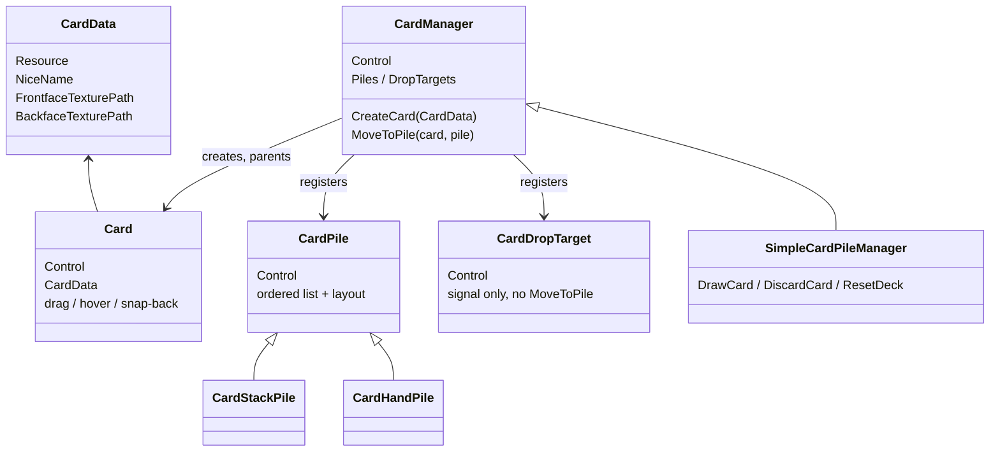
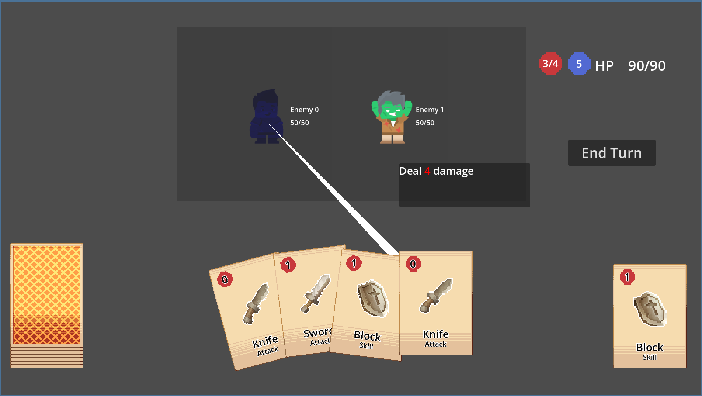

# Godot Card Pile Framework
A card game framework for Godot with C#.  
Developed and tested on Godot 4.7.1 with .NET 8.0.  
**This repository is in rapid iteration. The project may undergo significant refactoring.**
## Overview
There are several card-game framework/plugins available for Godot developers. However, similar work for developers who prefer to use C# is still in urgent need. Inspired by [simple-card-pile-ui](https://github.com/insideout-andrew/simple-card-pile-ui) and [card-framework](https://github.com/chun92/card-framework), this repository provides a lightweight framework using C#. You can use this framework to build a typical card-game (e.g., TCG and deck-building games) in few minutes.

The addon only owns **which pile a card belongs to** and **how cards move**. Play legality, effects, energy, and deck-building rules stay in your game.

The main features are:
* **Create and control card objects**. Instantiate card UI as Control nodes from a `CardData` Resource.
* **Manage card piles**. Generic N-pile membership via `MoveToPile`, plus optional draw / hand / discard helpers.
* **Drop targeting**. Separate hit-test regions that emit a signal on release; they never change pile membership.
* **UI motion**. Drag, hover, snap-back, stack layout, and fan-hand layout.

## Table of Contents
- [Installation](#Installation)
- [Architecture](#Architecture)
- [Classes](#Classes)
- [Usage](#Usage)
- [Example](#Example)
- [Credits](#Credits)
## Installation
* Download the project, and open it with Godot editor.
* Or copy the `CardPileFramework/addons/card_pile_framework` folder and paste in your project.
* Enter `using Ggross.CardPileFramework` at the start of your `.cs` script file.
## Architecture
Two layers:

* **Core** — `CardManager`, `Card`, `CardData`, `CardPile`, `CardDropTarget`. Any number of piles. Cards are always children of the manager; changing piles does not reparent them.
* **STS wrapper** — `SimpleCardPileManager` registers named draw / hand / discard piles and exposes move-only helpers (`DrawCard`, `DiscardCard`, `ResetDeck`). It does not resolve plays, shuffle discard into draw, or enforce hand size.

`CardDropTarget` is not a pile. On mouse release the card snaps back to its current pile unless **your game** calls `MoveToPile` (or `DiscardCard`) from the drop signal.
## Classes

```mermaid
classDiagram
    class CardData {
        Resource
        NiceName
        FrontfaceTexturePath
        BackfaceTexturePath
    }
    class Card {
        Control
        CardData
        drag / hover / snap-back
    }
    class CardPile {
        Control
        ordered list + layout
    }
    class CardStackPile
    class CardHandPile
    class CardDropTarget {
        Control
        signal only, no MoveToPile
    }
    class CardManager {
        Control
        CreateCard(CardData)
        MoveToPile(card, pile)
        Piles / DropTargets
    }
    class SimpleCardPileManager {
        DrawCard / DiscardCard / ResetDeck
    }

    CardData <-- Card
    CardPile <|-- CardStackPile
    CardPile <|-- CardHandPile
    CardManager <|-- SimpleCardPileManager
    CardManager --> Card : creates, parents
    CardManager --> CardPile : registers
    CardManager --> CardDropTarget : registers
```

| Class | Role |
| --- | --- |
| `CardData` | Godot `Resource`. Subclass it for cost, type, effects, etc. |
| `Card` | Card UI. Override `UpdateDisplay`. Does not know about draw/hand/discard. |
| `CardPile` | Ordered list, layout, and drag policy (`CanDragCards`, `OnlyTopCardInteractive`). |
| `CardStackPile` | Stacked layout for draw / discard style piles. |
| `CardHandPile` | Fan layout. `MaxHandSize` is visual / query-only; it does not discard overflow. |
| `CardDropTarget` | Registered hit-test region. Emits `CardDroppedOnTarget`; does not move cards. |
| `CardManager` | `CreateCard`, `MoveToPile`, pile / drop-target registry, `card → pile` map. |
| `SimpleCardPileManager` | Optional three-pile manager. Move-only. |
## Usage
1. Place a `CardManager` (or `SimpleCardPileManager`) in the scene and assign a card `PackedScene`.
2. Place `CardPile` nodes (stack and/or hand) and drop-target nodes. Export them on the manager (`Piles` / `DropTargets`, or the three named piles on the STS wrapper). Do not export a back-reference to the manager on each pile.
3. Subclass `CardData` and `Card` for your game. Create cards with `CreateCard` / `ResetDeck`, then `MoveToPile`.
4. On drop, handle `CardDroppedOnTarget` (or override `OnCardDropped` on your target). If the play is legal, call `MoveToPile` or `DiscardCard`; otherwise the card returns to its pile.

Deck JSON, if you still want it, belongs in the game or example — not in the addon.
## Example
A turn-based card-battle demo lives in `CardPileFramework/examples/card_battle`.

The demo shows how game rules sit **outside** the addon:

* `MyCard` / `MyCardData` extend `Card` / `CardData`.
* `Enemy` and `SkillZone` extend `CardDropTarget` and spend energy / deal damage themselves.
* `ExampleDeckLoader` reads JSON into `CardData` resources, then calls `ResetDeck`.
* Empty draw pile: `CardBattle` shuffles the discard pile back into the draw pile.
## Credits
* Thanks a lot to [simple-card-pile-ui](https://github.com/insideout-andrew/simple-card-pile-ui) and [card-framework](https://github.com/chun92/card-framework). In addition to the conceptual inspiration, a part of scripts are converted from their GDScript codes.
* Graphical assets are from [Kenney](https://www.kenney.nl/assets/platformer-characters), [Cazwolf](https://cazwolf.itch.io/pixel-fantasy-cards), and [Cainos](https://cainos.itch.io/pixel-art-icon-pack-rpg).
* License: [MIT License](LICENSE)
