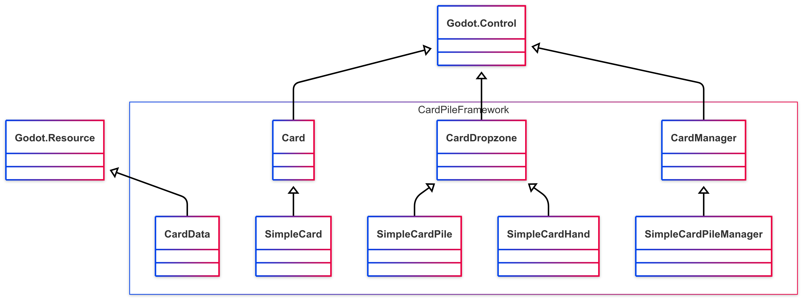

# Godot Card Pile Framework
A card game framework for Godot with C#.  
Developed and tested on Godot 4.4 with .Net 8.0.  
**This repository is in rapid iteration. The project may undergo significant refactoring.**
## Overview
There are several card-game framework/plugins available for Godot developers. However, similar work for developers who prefer to use C# is still in urgent need. Inspired by [simple-card-pile-ui](https://github.com/insideout-andrew/simple-card-pile-ui) and [card-framework](https://github.com/chun92/card-framework), this repository provides a lightweight framework using C#. You can use this framework to build a typical card-game (e.g., TCG and deck-building games) in few minutes.   

The main features are:  
* **Create and control card-objects**. Create card objects as Control nodes, customize its view and properties.
* **Manage card piles**. A simple manager for typical card-game with hand cards, draw and discard piles.
* **Save and load**. Save/load card and deck data in .json format.
* **UI animations**. Highly customizable animations and signal system for drag, drop, draw, use and discard cards.

## Table of Contents
- [Installation](#Installation)
- [Classes](#Classes)
- [Example](#Example)
- [Credits](#Credits)
## Installation
* Download the project, and open it with Godot editor.
* Or copy the `CardPileFramework/addons/card_pile_framework` folder and paste in your project.
* Enter `using Ggross.CardPileFramework` in start of your .cs script file.
## Classes
The currently available classes of the framework are listed below:    
  
Drawn with [mermaid-js](https://github.com/mermaid-js/mermaid).
## Example
To better show how the framework works, a demo of turn-based card-battle game is available.  
  
## Credits
* Thanks a lot to [simple-card-pile-ui](https://github.com/insideout-andrew/simple-card-pile-ui) and [card-framework](https://github.com/chun92/card-framework). In addition to the conceptual inspiration, a part of scripts are converted from their GDScript codes.
* Graphical assets are from [Kenney](https://www.kenney.nl/assets/platformer-characters), [Cazwolf](https://cazwolf.itch.io/pixel-fantasy-cards), and [Cainos](https://cainos.itch.io/pixel-art-icon-pack-rpg).
* License: [MIT License](LICENSE)
